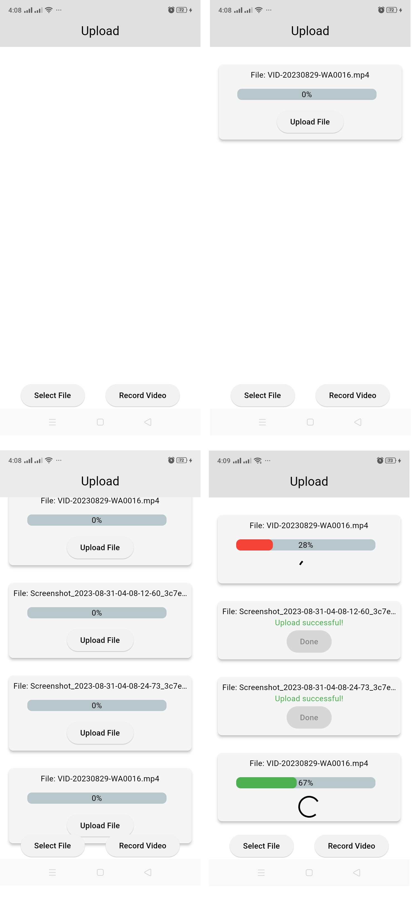
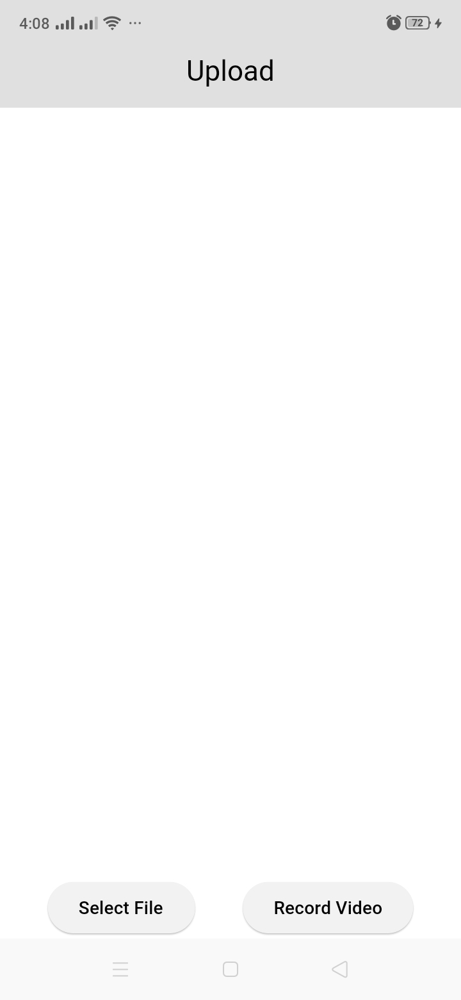
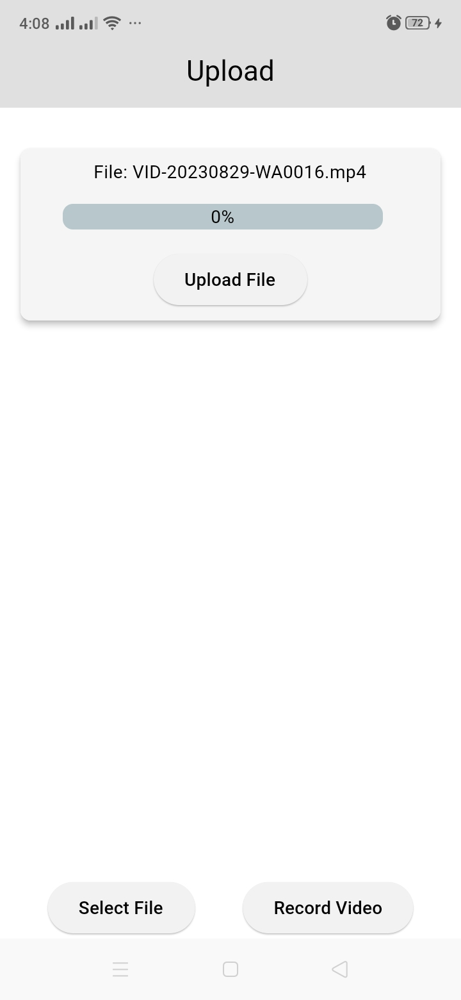
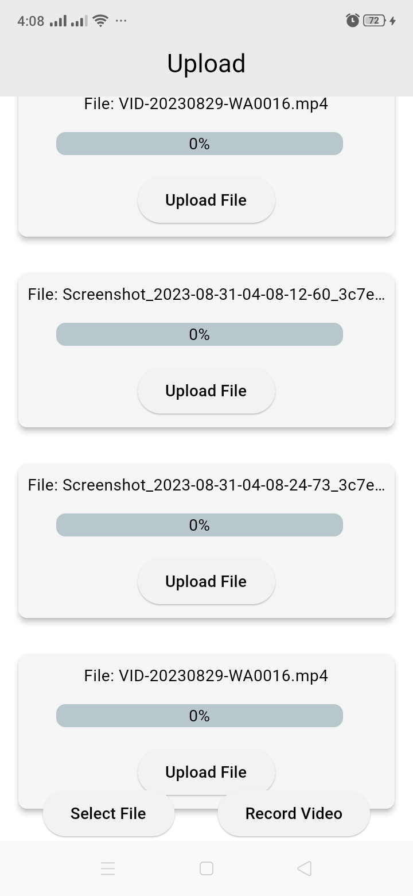
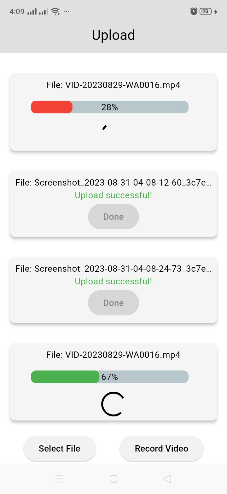

# Video Record

### Please note this some parts of this code is generated by AI, and I am modified it by app needs

## Gmail account to access Firebase project
### Email: "taskmisk@gmail.com"
### Password: "123123misk"
### Firebase project: "https://console.firebase.google.com/u/1/project/taskmisk-30925/overview"

## Flutter Version
### Flutter 3.10.6 • channel stable • https://github.com/flutter/flutter.git
### Framework • revision f468f3366c (7 weeks ago) • 2023-07-12 15:19:05 -0700
### Engine • revision cdbeda788a
### Tools • Dart 3.0.6 • DevTools 2.23.1

## Packages
### firebase_core
### firebase_storage
### file_picker
### flutter_bloc
### percent_indicator
### equatable
### camera
### video_player
### path_provider

# Screenshot's

